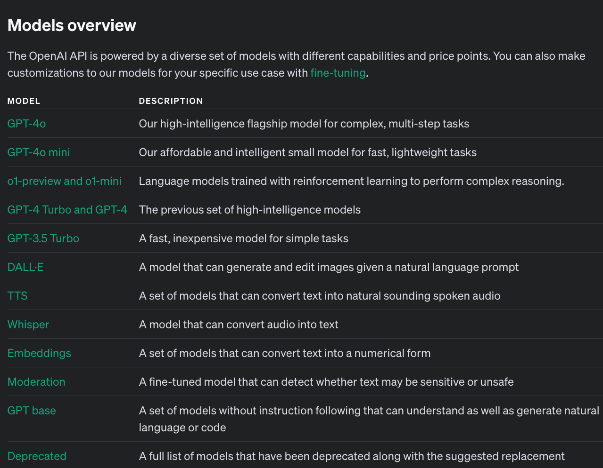

# The OctoFit Tracker app story

## OctoFit Tracker: Building a Fitness App with GitHub Copilot

Welcome to the **OctoFit Tracker** app workshop! In this hands-on session, you'll step into the shoes of a lead developer tasked with creating a cutting-edge fitness tracker app in record time. We'll leverage the power of **GitHub Copilot** to rapidly develop a functional prototype of **OctoFit Tracker**, a social fitness app that encourages users to stay active and to compete with their peers.

### Workshop Overview

In this workshop, you'll:

1. Set up a development environment using **GitHub Codespaces**
2. Use **GitHub Copilot** to accelerate development across multiple technologies
3. Build key components of the **OctoFit Tracker** app
4. Learn best practices and prompting techniques for working with **GitHub Copilot**

> :blue_book: **NOTE**: Because we have only 20 minutes for the actual workshop, it is possible that we cannot complete everything. However, we will have the value of troubleshooting together and you can continue on with this repository after you leave GitHub Universe.

### Application Features

**OctoFit Tracker** will include:

- User authentication and profiles
- Activity logging and tracking
- Team creation and management
- A competitive leaderboard
- Personalized workout suggestions

### GitHub Copilot and Copilot Chat

GitHub Copilot and Copilot Chat uses OpenAI GPT models for its coding suggestions and chat interaction.
OpenAI gpt-4o: *"Our high-intelligence flagship model for complex, multi-step tasks. GPT-4o is cheaper and faster than GPT-4 Turbo. Currently points to gpt-4o-2024-08-06"*

#### [OpenAI GPT models explained](https://platform.openai.com/docs/models)

#### Prompt engineering

- [GitHub documentation prompt engineering](https://docs.github.com/en/copilot/using-github-copilot/prompt-engineering-for-github-copilot)
- [How to use GitHub Copilot: Prompts, tips, and use cases](https://github.blog/2023-06-20-how-to-write-better-prompts-for-github-copilot/)
- [Using GitHub Copilot in your IDE: Tips, tricks, and best practices](https://github.blog/2024-03-25-how-to-use-github-copilot-in-your-ide-tips-tricks-and-best-practices/)
- [A developer’s guide to prompt engineering and LLMs](https://docs.github.com/en/copilot/using-github-copilot/prompt-engineering-for-github-copilot#:~:text=A%20developer%E2%80%99s%20guide%20to%20prompt%20engineering%20and%20LLMs)
- [Prompting GitHub Copilot Chat to become your personal AI assistant for accessibility](https://github.blog/2023-10-09-prompting-github-copilot-chat-to-become-your-personal-ai-assistant-for-accessibility/)

OpenAI gpt-4o: *"Our high-intelligence flagship model for complex, multi-step tasks. GPT-4o is cheaper and faster than GPT-4 Turbo. Currently points to gpt-4o-2024-08-06"*

> NOTE: we will be using gpt-4o in GitHub Copilot Chat for this workshop at GitHub Universe.

### Technology Stack

We'll be using a modern web application stack:

- **Frontend**: React.js
- **Backend**: Python with Django REST Framework
- **Database**: MongoDB
- **Development Environment**: GitHub Codespaces

### Workshop Structure

1. **Introduction**
   - Overview of OctoFit Tracker app concept
   - OpenAI GPT models

2. **Setup of Prerequisites**
   - Setting up GitHub Codespaces
   - Ensure GitHub Copilot and Copilot Chat extensions are up to date

3. **Rapid Prototyping with GitHub Copilot**
   - Creating project structure
   - Generating boilerplate code
   - Implementing basic models, serializers, urls, and views

4. **Building Core Features**
   - User authentication
   - Activity logging API
   - Team management
   - Leader board functionality

5. **Frontend Development**
   - Setting up React components
   - Implementing responsive UI
   - Connecting to backend APIs

6. **Advanced Features and Optimization**
   - Adding personalized workout suggestions
   - Implementing caching with Redis
   - Optimizing database queries

7. **Wrap-up and Q&A**
   - Reviewing what we've built
   - Discussing best practices and lessons learned
   - Q&A session

### Key Takeaways

By the end of this workshop, attendees will:

- Gain hands-on experience with **GitHub Copilot** in a real-world scenario
- Learn strategies for effective AI-assisted development
- Learn how to effectively prompt GitHub Copilot to get accurate responses from GitHub Copilot
- Understand how to leverage Copilot across different languages and frameworks
- Develop a functional prototype of a modern web application

Join us for this exciting journey into the future of software development, where we'll harness the power of generative AI with GitHub Copilot to build OctoFit Tracker in record time!

In this workshop, you are going to assume to be the lead developer. You will be responsible for building the application with GitHub Copilot’s help. Good luck!

[Next: Prerequisite and setup of the development environment :arrow_forward:](../2_Prerequisites/README.md)
