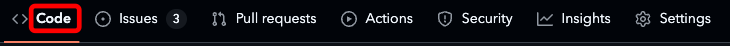
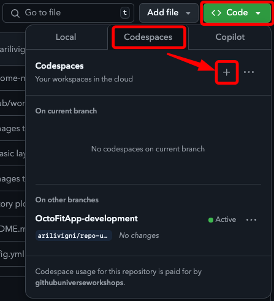
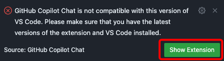
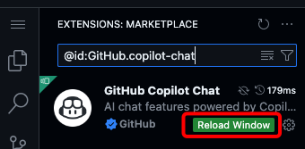

# Prerequisites and setup of the development environment

## Prerequisites

- GitHub account
- GitHub Copilot license

## OctoFit Tracker technology stack

- NodeJS: Version v20.17.0
- ReactJS: Version v18.3.1
- Python Django: Version v4.1

## Developer environment setup

### Option 1: Using a Copilot + Codespaces

You are not required to use GitHub Codespaces
but, this is what we are using for the GitHub Universe workshop

#### Go to the code tab

#### Create a GitHub codespace

#### Once the GitHub Codespace is created

When the codespace is created you may get the following message for the GitHub Copilot Chat extension

 

### Option 2: Use your IDE of choice

- If you choose this option we recommend using VSCode as your IDE, but this workshop is not limited to VSCode
- URL for REACT and Django will be `http://localhost` or `http://127.0.0.1`

If you ever get stuck, don't worry. Please check out the [troubleshooting guide](../9_Troubleshooting/), and GitHub Experts will be here to help you.

[:arrow_backward: Previous: The OctoFit Tracker app story](../1_Story/README.md) | [Next: Getting started - app frontend and backend creation :arrow_forward:](../3_GettingStarted/README.md)
