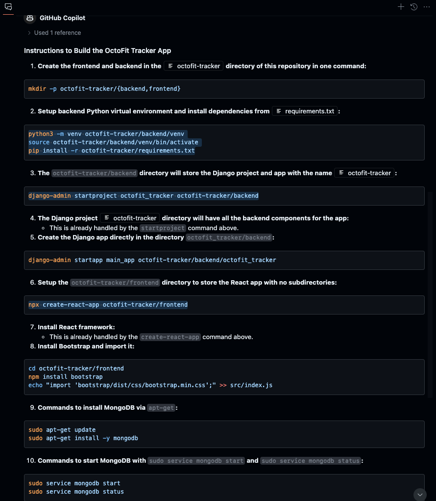
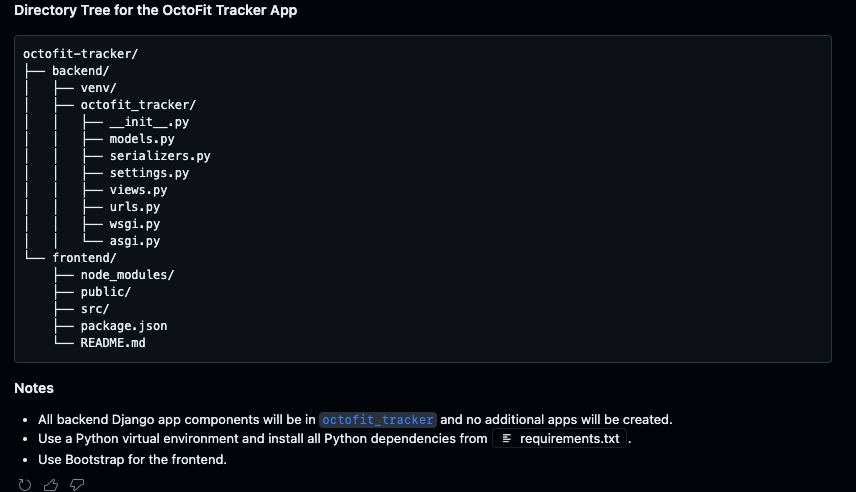

# Getting started - app frontend and backend creation

In this section, we will start by setting up the face of our OctoFit application by building the front end page. To do that, we will keep it as simple as possible for now. We need resources like HTML and CSS to start decorating first, and we will later modify the page to extend the functionalities.

> TIP: One challenging thing about GitHub Copilot is that it is very generative. Thus, it is hard to make a consistent, repeatable tutorial unless you try to keep it simple and very progressive.

## Explain to GitHub Copilot the goals and steps

It is important to lay out a plan, provide details, and be specific.</br>
Type the following prompt in GitHub Copilot Chat:

> TIP: we are going to use gpt-4o as our OpenAI GPT model for this GitHub Universe Workshop

```text
I want to build an OctoFit Tracker app that will include the following:

* User authentication and profiles
* Activity logging and tracking
* Team creation and management
* Competitive leader boards
* Personalized workout suggestions

It should be in one app

generate instructions in this order

1. Create the frontend and backend in the octofit-tracker directory of this repository in one command
2. Setup backend python venv and install octofit-tracker/requirements.txt first
3. The octofit-tracker/backend directory will store the django project and app with the name octofit-tracker
4. The Django project octofit-tracker directory will have all the backend components for the app
5. Create the django app directly in the directory octofit_tracker/backend
6. Setup the octofit-tracker/frontend directory will store the react app with no subdirectories
7. install react framework
8. Install bootstrap and import it
9. Commands to install mongodb via 'apt-get' 
10. Commands start mongodb with the 'sudo service mongodb start' and 'sudo service mongodb status'

Tha directory tree for the OctoFit Tracker App

octofit-tracker/
├── backend/
│   ├── venv/
│   ├── octofit_tracker/
│   │   ├── __init__.py
│   │   ├── models.py
│   │   ├── serializers.py
│   │   ├── settings.py
│   │   ├── views.py
│   │   ├── urls.py
│   │   ├── wsgi.py
│   │   └── asgi.py
└── frontend/
    ├── node_modules/
    ├── public/
    ├── src/
    ├── package.json
    └── README.md

All of the backend django app will be in octofit_tracker and do NOT create another app of any kind

Use a Python virtual environment and install all python dependencies from file octofit-tracker/requirements.txt in this workspace

The octofit-tracker/requirements.txt already contains all Django requirements. Django, djongo, sqlparse

Layout the directory structure with no redundant backend and frontend subdirectories

Use bootstrap for the frontend

Let's think about this step by step

Important to avoid using public code and we do NOT need to initialize the git repository
```

</br>

</br>

</br>

### Cheat sheet of commands to use to create the OctoFit Tracker structure

```bash
mkdir -p octofit-tracker/{backend,frontend}

python3 -m venv octofit-tracker/backend/venv
source octofit-tracker/backend/venv/bin/activate
pip install -r octofit-tracker/requirements.txt

django-admin startproject octofit_tracker octofit-tracker/backend

npx create-react-app octofit-tracker/frontend

cd ../frontend
npm install bootstrap

echo "import 'bootstrap/dist/css/bootstrap.min.css';" >> src/index.js

sudo apt-get update
sudo apt-get install -y mongodb

sudo service mongodb start
sudo service mongodb status
```

[:arrow_backward: Previous: Prerequisites and development environment setup](../2_Prerequisites/README.md) | [Next: Let's work on front end stuff :arrow_forward:](../4_FrontEndWork/README.md)